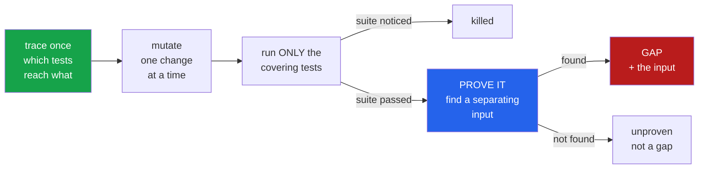

<h1 align="center">suite-auditor (Python · ast · mutation testing · differential testing · sys.settrace)</h1>
<p align="center"><i>What your test suite would not notice — with the input that proves it</i></p>

<p align="center">
  <a href="#the-through-line">The through-line</a> &middot;
  <a href="#the-result">The result</a> &middot;
  <a href="docs/RESULTS.md">Full results</a> &middot;
  <a href="#how-it-works">How it works</a> &middot;
  <a href="#run-it">Run it</a> &middot;
  <a href="#what-this-does-not-do">What it does NOT do</a> &middot;
  <a href="#problems-hit-while-building-this">Problems hit</a>
</p>

<p align="center">
  <a href="https://github.com/hammasbuilds/suite-auditor/actions/workflows/ci.yml"></a>
  
  
  
  
  <a href="LICENSE"></a>
</p>

---

## The through-line



A mutant your suite fails to kill is *suspicious*, not damning — some mutants are equivalent
to the original and no test could ever catch them. So a survivor only becomes a **gap** once
there is a concrete input on which it and the original return different things.

> **A mutation score tells you 28% survived. It does not tell you which 28%, or whether any
> of it matters.**

## The result

Two audits. No model involved anywhere in this tool.

| | [`toolz`](https://github.com/pytoolz/toolz) | [`repo-surgeon`](https://github.com/hammasbuilds/repo-surgeon) |
|---|---:|---:|
| functions in the package | 157 | 67 |
| **reached by no test** | 14 | **28 (42%)** |
| mutants scored | 181 | 100 |
| **kill rate** | **90.6%** | **68.0%** |
| proven gaps | 4 | 3 |
| of those, unarguable | **0** | **0** |
| unproven survivors | 13 | 29 |

`toolz` is a functional library maintained since 2013. `repo-surgeon` is one of mine,
shipped hours before this run, whose README says *"47 tests, all on the code that decides"*.

**42% of its functions have no test at all** — including `pipeline.py::run`, the orchestrator
the whole tool is built around. The test count was true and it measured nothing.

### The cheapest finding is the most useful one

Neither audit produced a gap worth sending to a maintainer. Both produced a list of functions
nothing executes — and that costs **one suite run**, no mutation, seconds rather than minutes:

```bash
suite-auditor coverage <repo>
```

### And a maintained suite accepts very little

This is the same measurement as
[`mbpp-false-accepts`](https://github.com/hammasbuilds/mbpp-false-accepts), pointed at real
code instead of a benchmark. There, MBPP's three-assert suites let **17.6%** of mutants
through and 29% of problems accepted a provably wrong program. Here a real suite kills
**90.6%**.

Three asserts accept a lot. A suite somebody maintains accepts very little. Worth knowing
before drawing conclusions about test adequacy from a benchmark.

See [docs/RESULTS.md](docs/RESULTS.md) for both runs in full.

## How it works

**Trace once.** A ~40-line pytest plugin is written into the target, the suite runs once
under `sys.settrace`, and the plugin is removed. That gives `function → the tests that reach
it`. Only those tests can kill that function's mutants, and the median is two — so instead of
500 tests per mutant, it runs two. That is the difference between minutes and an overnight
job.

**Mutate plausibly.** Five operators: comparison, arithmetic, boolean, integer constant,
negated `if`. Deleting a function body produces a mutant every suite kills and teaches
nothing; a `<` that should be `<=` is the off-by-one somebody actually writes — and in
`mbpp-false-accepts` that operator survived 25.9% of the time, the highest of any.

**Prove every survivor.** The original and the mutant are loaded into separate module
namespaces and called on the same inputs, drawn from **the tests that cover that function**.
A repo-wide pool handed a function expecting signature objects the argument `(0, 0)`, and the
resulting "proof" was one any maintainer would close on sight.

**Grade the evidence.** Every gap carries a grade, and the report leads with the best:

| grade | meaning |
|---|---|
| 0 | both versions return a value, and the values differ — unarguable |
| 1 | one returns, the other raises — real; the reader judges the input |
| 2 | both raise, differently — weakest |

Across both audits **every gap is grade 1 or 2**. The tool says so, rather than presenting
seven "findings" and letting the reader work it out.

## Run it

```bash
git clone https://github.com/hammasbuilds/suite-auditor
cd suite-auditor
uv venv && uv pip install -e ".[dev]"

# one suite run: which functions does no test reach?
suite-auditor coverage /path/to/repo

# the full audit
suite-auditor audit /path/to/repo --test tests --out audit-out

# in CI
suite-auditor audit . --fail-on-gap
```

Needs nothing running — no model, no API key, no GPU. The target repo's own dependencies
must be installed, since its suite has to run.

## Layout

```
src/suite_auditor/
  coverage.py      the settrace plugin; function -> covering tests, in one suite run
  mutate.py        five operators, and the functions worth pointing them at
  inputs.py        argument values from the covering tests, and witness grading
  differential.py  run both versions side by side; drain iterators; ignore addresses
  audit.py         kill / survive / prove, restoring the file in a finally
  report.py        gaps first, strongest evidence first, unproven kept separate
```

## What this does NOT do

- **It does not claim a gap it cannot prove.** Survivors without a separating input are
  reported as unproven and never counted. Some are equivalent mutants; counting them is how
  a mutation tool inflates a bug count in a way nobody can check.
- **It does not mutate what no test reaches.** Those functions contribute nothing to the kill
  rate, so a suite can post a high score over a small covered fraction — which is exactly
  what `repo-surgeon` does.
- **It does not replace a mutation-testing framework.** `mutmut` and `cosmic-ray` are more
  thorough. This one adds the proof step and the grading, and is a single file's worth of
  dependencies.
- **Two repositories, one of them mine.** A kill rate is a property of a suite; two suites
  are not a survey.

## Problems hit while building this

- **The coverage map came back empty, and nothing raised.** `build_map` took a relative path
  while the subprocess ran with `cwd=repo`, so the plugin wrote its output one directory
  deeper than anyone looked. Every function in the project read as uncovered — and an
  auditor that thinks nothing is covered reports no gaps and looks like it is working. A
  clean zero is now something I treat as suspect by default.
- **The first gaps it found were worthless.** Values harvested repo-wide gave a function
  expecting signature objects the argument `(0, 0)`, and "proved" it differed. Real, and
  useless. Values now come from the covering tests.
- **It mis-graded its own evidence.** The single "unarguable" gap in the `toolz` audit was
  an artefact: a drained generator that raised renders as `ok: []...then TypeError: ...`, and
  the grader read only the `ok` prefix. Both sides had raised. Re-graded, there are zero.
- **pytest collected an imported helper as a test.** `tests_for` starts with `test`, so it
  was picked up and errored on every run — harmless, invisible, and it would have sat in CI
  indefinitely.

## Also worth reading

| | |
|---|---|
| &#128202; **[Results](docs/RESULTS.md)** | Both audits in full, with the limits |
| **[mbpp-false-accepts](https://github.com/hammasbuilds/mbpp-false-accepts)** | The same measurement on a benchmark: three asserts let 17.6% through |
| **[repo-surgeon](https://github.com/hammasbuilds/repo-surgeon)** | The sibling this audited, and found 42% of untested |
| **[pr-referee](https://github.com/hammasbuilds/pr-referee)** | The same differential engine, pointed at diffs |

## Keywords

mutation testing &middot; test adequacy &middot; test quality &middot; kill rate &middot;
equivalent mutants &middot; differential testing &middot; coverage &middot; sys.settrace
&middot; pytest plugin &middot; test impact analysis &middot; separating input &middot;
static analysis &middot; AST &middot; CI

## License

MIT - see [LICENSE](LICENSE).
